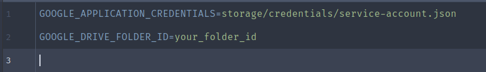

<h1 align="center">Laravel Google Drive</h1>

<p align="center">
    <a href="https://github.com/fnsc/laravel-google-drive/graphs/contributors" alt="Contributors"></a>
    <a href="https://github.com/fnsc/laravel-google-drive/actions?query=workflow%3ATests"></a>
    <a href="https://www.codacy.com/gh/fnsc/laravel-google-drive/dashboard?utm_source=github.com&amp;utm_medium=referral&amp;utm_content=fnsc/laravel-google-drive&amp;utm_campaign=Badge_Grade"></a>
<a href="https://www.codacy.com/gh/fnsc/laravel-google-drive/dashboard?utm_source=github.com&amp;utm_medium=referral&amp;utm_content=fnsc/laravel-google-drive&amp;utm_campaign=Badge_Coverage"></a>
</p>


- [Introduction](#introduction)
- [Requirements](#requirements) 
- [Installation](#installation)
- [Usage Guide](#guide)
- [License](#license)

## Introduction
This library provides a simple and easy way to deal with [Google Drive](https://drive.google.com) files.

## Requirements
- PHP >= 8.1^
- Laravel >= 9.*

## Installation
You can install the library via Composer:
```bash
composer require fnsc/laravel-google-drive
```

## Guide
First, add this file `LaravelGoogleDrive\Infra\Providers\LaravelGoogleDriveServiceProvider::class` to your `config/app.php` file.
<p align="center"></p>

Then publish the `google_drive.php` config file using the following command. That will add `google_drive.php` config file into you `config` directory. 
```bash
php artisan vendor:publish --provider="LaravelGoogleDrive\Infra\Providers\LaravelGoogleDriveServiceProvider"
```
<p align="center"></p>

Now go to [Google Cloud Platform](https://console.cloud.google.com) and create a service account using this [link](https://console.cloud.google.com/apis/credentials) and click on Service Account.
<p align="center"></p>

When you finish, the Google Service Manager will generate a .json file. That file contains your credentials. Download it and keep it safe. 

Add this file to your project, and **DO NOT ADD THIS FILE TO YOUR GIT REPOSITORY**.

Now add the following `env_vars` into your `.env` file. The `GOOGLE_APPLICATION_CREDENTIALS` is the path to your `service-account.json` file, and the `GOOGLE_DRIVE_FOLDER_ID` is your directory on Google Drive.
<p align="center"></p>

Now you must share the Google Drive directory with the `client_email` present in your `service-account.json` file, granting privileges to read and write.

Finally, you can follow the [examples](./examples/web.php). 

## License
This package is free software distributed under the terms of the [MIT license](http://opensource.org/licenses/MIT)